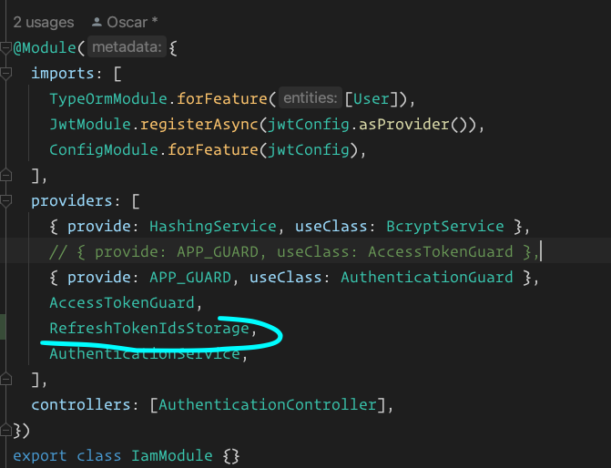
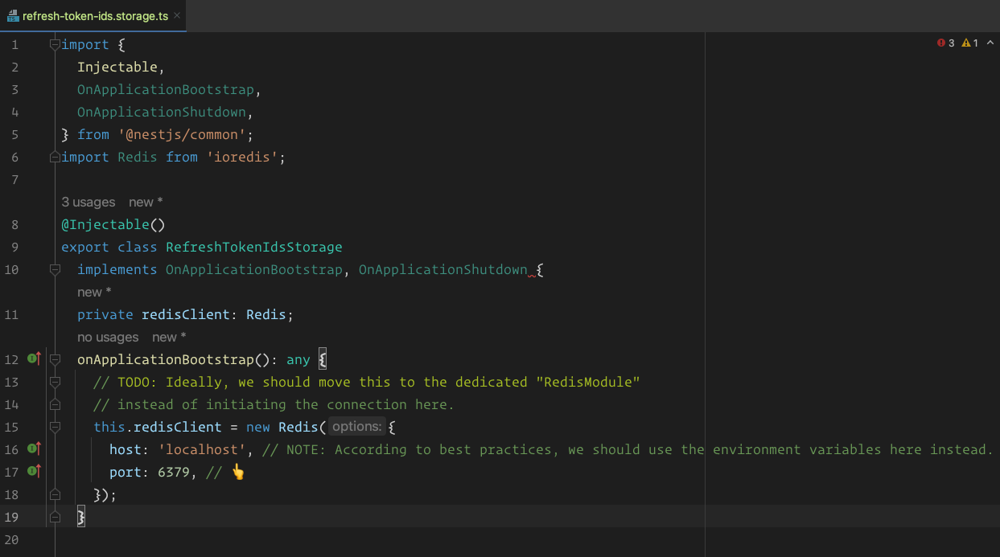

One of the benefits of JWT or JSON web tokens, is that they are 
stateless, that means we don't have to query a central database to 
validate the token on each incoming request.
As long as the token signature is valid and the token hasn't expired 
itself, we can authenticate the request and associate it with the 
corresponding user.
This poses a challenge though, let's say we would like to invalidate 
a leaked or compromised refresh token to prevent the attacker from 
login into our system, or let's say the admin has updated the use's Role 
or Permissions - as they should be automatically logged out, in case the 
user's roles were embedded into the token themselves.

How can we accomplish or fix any of these issues ?

Since our tokens are stateless, we cannot revoke them as they are not stored in 
the database unless we remove the principal or target user. But usually this is not
what we want to do.

What about storing tokens in the database ?

With this approach we could check which tokens are valid and which ones have to be
revoked based whether they are still in the database or not.

But this makes JWT stateful and behave similarly to credentials. Essentially, in 
order to make that idea work, we would have to keep a list of all issued tokens in a 
dedicated table or in the existing user's table.

Then the guard we implemented we would have to query the database on every incoming 
request just to check if the given token is included in the list of stored tokens.
I think you could imagine that this would have a negative impact on our app performance.
So as you can see this approach is not ideal.

There is a middle ground solution, implementing a mechanism called 
REFRESH TOKEN ROTATION, Whenever a refresh token was used to issue a new pair of
tokens, we will invalidate original one (or old refresh token) so it cannot be used
again in the future. 
To do all of this, we add a REDIS database to our stack, but we could use any 
database we would like. 
REDIS is lightweight key value storage system that provides great performance and 
it's all we need to accomplish the task at hand.

To do this we need to change the docker compose file and add REDIS package.

```
version: "3"
services:
    db:
        image: postgres
        restart: always
        ports:
            - "5432:5432"
        environment:
        POSTGRES_PASSWORD: pass123
    redis:
        image: redis
        ports:
            - "6379:6379"
        restart: always
```
we install the package ioredis, `npm i ioredis`

We then run `docker-compose up -d`

and generate a RefreshTokenIdStorage class using the following command
`nest g class iam/authentication/refresh-token-ids.storage`

And we then register in the iam.module.ts the RefreshTokenIdsStorage 
as a provider.



Ideally we would move and registered a separate Redis module that 
encapsulates the Redis client and ties itself to the application 
lifecycle. However since the primary focus of the POC is on 
authentication and authorization I decided to take a shortcut here
not to spend too much time on these things.
STILL this process is ok, but as a reminder in the ideal world we 
would want to separate this out.




On the `onApplicationShutdown` we just need to add the `redisClient.quit()`
meaning when the application shuts down it will terminate the Redis connection.

Now there are few methods that we need to implement for some business
logic.

Insert new entries into the Redis database
`async insert(userId: number, tokenId: string): Promise<void> {}`

Validate the token ID passed in and depending on the validation 
we implement we will return true or false
`async validate(userId: number, tokenId: string): Promise<boolean> {}`

Invalidate will help us to invalidate the token by removing 
the ID entry from our database.
` async invalidate(userId: number): Promise<void> {}`

And last, the private method getKey which constructs the entryID 
based on the user identifier.
` private getKey(userId: number): string {}`


### Automatic Reuse Detection

Automatic Reuse Detection is a key component of any solid refresh token rotation strategy.

In fact, we have already this detection functionality implemented in our code. Is that at 
the moment though we don't react differently in any case where the old refresh token was
attempted to be reused.


