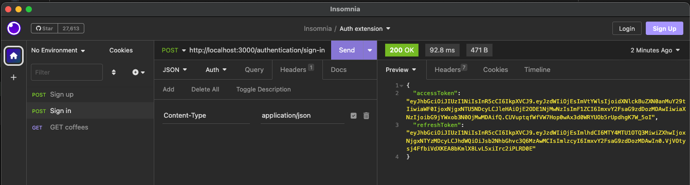

### Alongside the access token we received the new added refresh token 

## How can we use it?
There are two viable approaches.
- The first approach we could modify the existing sign-in endpoint to accept additional properties in the request body.
  - respectively Grant which indicates what strategy we want to use, TOKEN or CREDENTIALS.
  - The second approach we can expose a new endpoint that validates the incoming refresh token and generates access and 
    refresh token pairs for us.

### For simplicity's sake we use the second approach but know there are other options available to achieve this.

